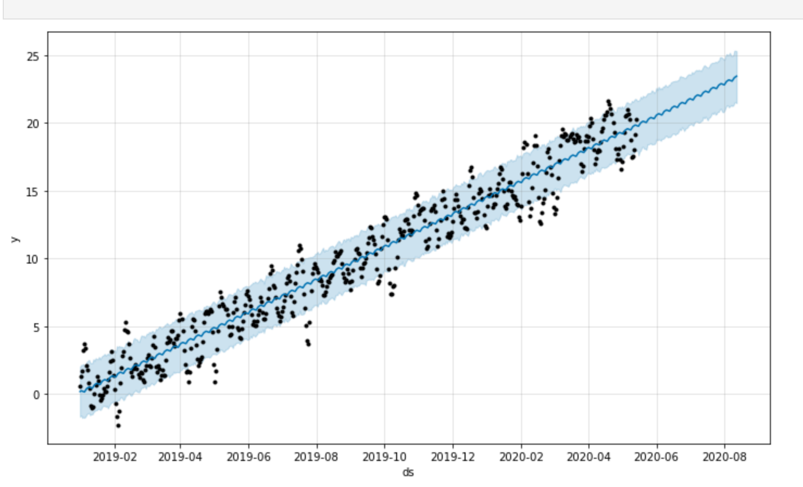

# Mercado_de_Prophet
Utilizes the Facebook Prophet library and Pandas data mining tools to discover if there is a correlation between search traffic seasonality and stock price volalitity for Mercado Libre. An added feature to this notebook is a prediction of sales profit based on historical sales data. A best case, worst case and most likely outcome is given.


---

## Technologies

Language: Python 3.9.12

Libraries used:

[Pandas](https://pandas.pydata.org/pandas-docs/stable/index.html) - For the creation and visualization of Data Frames

[Jupyter Labs](https://jupyter.org/) - An ipython kernel for interactive computing in python

[PyViz hvPlot](https://hvplot.holoviz.org/index.html) - A high level python library for interactive data visualization

[Facebook Prophet](https://facebook.github.io/prophet/) - Industry standard for predicting time-series models


---

## Installation Guide

If you are using an anaconda or a conda environment (which is highly recommended) chances are pandas, hvplot and jupyter labs are already installed in your virtual environment. In addition, installing Facebook's Prophet library will be necessary

For a full install activate a conda development environment and run in GitBash if not already installed, otherwise pip can be used:
```python
    conda install pandas
    conda install jupyterlab
    conda install -c pyviz hvplot
```

To install the other dependencies not included in the anaconda environment run:
```python
    conda install prophet
```

Check the to make sure everything has been installed properly
```python
    conda list pandas
    conda list hvplot
    conda list jupyter lab
    conda list prophet
```

---

## Usage

To run this jupyter lab notebook you will need to use GitBash and navigate to where you have exported the files associated with this project and activate your dev environment.
Initiate the jupyter lab local server by  using the command:

```python
    jupyter lab
```

Next, this project can be ran by navigating to the **forecasting_net_prophet.ipynb** jupyter notebook file and clicking the double arrow as seen below:


This will run the jupyter notebook and each cell has proper pseudocode directing the viewer as to which analyses are being shown. Additionally, the markdown cells provided also clue the reader in to what is going on.

There are a few interactive graphs along the way. 

**Fitting the models to the data takes some time so please allow for around 3-5 minutes per fitting session. There are 
two major fitting sessions in this notebook**


---

## Highlights:

### Predicted Trends for Mercado Libre


### Component Plot Details


### Sales Predictions




---

## Contributors

Created by Silvano Ross while in the UW FinTech Bootcamp
> Contact Info:
> email: silvanoross3@gmail.com |
> [GitHub](https://github.com/silvanoross) |
> [LinkedIn](https://www.linkedin.com/in/silvano-ross-b6a15a93/)


---

## License

[MIT](LICENSE)


